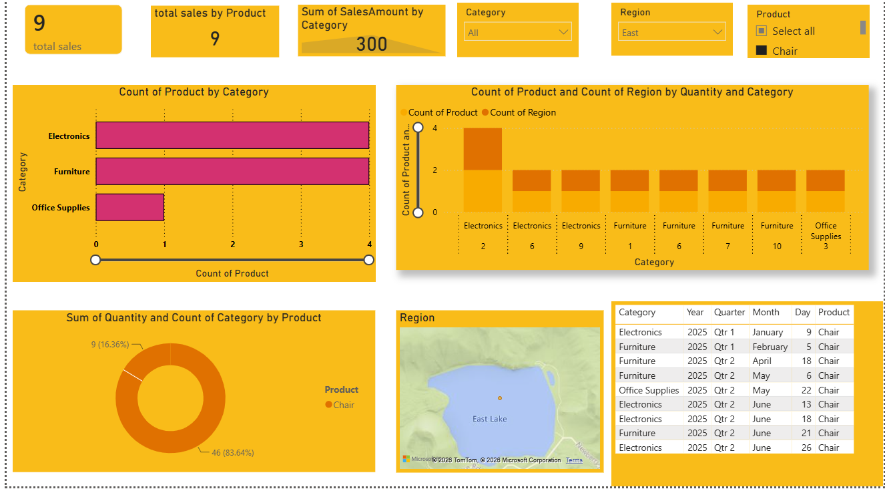

# -Sales-Performance-Dashboard


# 📊 Sales Performance Dashboard


---

# 📌 Project Overview

The Sales Performance Dashboard is an interactive Power BI solution designed to analyze product sales, category performance, regional distribution, and quantity trends.

This dashboard transforms raw sales data into meaningful business insights, helping organizations monitor product performance, understand category contributions, and evaluate regional sales activity.

---

# 🎯 Business Objective

The objective of this dashboard is to:

* Monitor total sales performance.
* Analyze category-wise product distribution.
* Evaluate quantity sold across products.
* Track regional sales activity.
* Identify top-performing product categories.
* Support business decision-making through visual analytics.

---

# 🛠 Tools & Technologies Used

* Power BI
* Power Query
* DAX
* Data Modeling
* Data Visualization
* Business Intelligence

---

# 📊 Dashboard Preview



---

# 📈 Key Performance Indicators (KPIs)

| KPI               | Description                      |
| ----------------- | -------------------------------- |
| Total Sales       | Overall sales generated          |
| Total Products    | Number of products sold          |
| Sales Amount      | Total revenue generated          |
| Category Analysis | Product distribution by category |
| Region Analysis   | Regional sales insights          |
| Quantity Analysis | Product quantity performance     |

---

# 📊 Dashboard Features

## 1️⃣ Sales Overview

The dashboard provides a quick overview of:

* Total Sales
* Product Count
* Sales Amount

These KPIs help stakeholders monitor business performance at a glance.

---

## 2️⃣ Category Analysis

Visualizes:

* Electronics
* Furniture
* Office Supplies

Insights:

* Compare product counts across categories.
* Identify high-performing categories.
* Analyze category contribution.

---

## 3️⃣ Product Performance Analysis

Tracks:

* Quantity sold by product.
* Product contribution to sales.
* Product distribution across categories.

Business Benefits:

* Identify best-selling products.
* Improve inventory planning.
* Optimize product offerings.

---

## 4️⃣ Regional Analysis

The dashboard includes geographical insights showing:

* Sales activity by region.
* Regional product demand.
* Market distribution.

Business Benefits:

* Regional expansion planning.
* Demand analysis.
* Territory performance evaluation.

---

## 5️⃣ Interactive Filtering

Users can dynamically filter data by:

* Category
* Product
* Region

This enables detailed exploration and drill-down analysis.

---

# 📊 Key Insights

### Category Performance

* Electronics and Furniture contribute significantly to product volume.
* Office Supplies show comparatively lower product count.

### Product Trends

* Product quantities vary across categories.
* Certain products dominate total quantity sold.

### Regional Analysis

* Regional sales tracking helps identify demand concentration.
* Geographic insights support market strategy planning.

---

# 📂 Dataset Information

The dataset includes:

* Product Name
* Category
* Region
* Quantity
* Sales Amount
* Year
* Quarter
* Month
* Day

---

# 📋 Dashboard Components

✅ KPI Cards

✅ Category Analysis

✅ Product Analysis

✅ Quantity Tracking

✅ Region Mapping

✅ Interactive Slicers

✅ Data Table View

✅ Business Intelligence Reporting

---

# 🚀 Future Enhancements

* Sales Forecasting
* Profitability Analysis
* Customer Segmentation
* Regional Growth Tracking
* Inventory Forecasting
* Predictive Analytics
* Real-Time Dashboard Integration

---

# 📁 Project Structure

```text
Sales-Performance-Dashboard/
│
├── images/
│   └── sales_dashboard.png
│
├── Sales_Dashboard.pbix
├── Sales_Data.xlsx
├── README.md
│
└── Assets/
```

---

# 🎓 Skills Demonstrated

* Data Cleaning
* Data Transformation
* DAX Measures
* Dashboard Design
* Data Storytelling
* Business Intelligence
* KPI Development
* Interactive Reporting

---

# 👨‍💻 Author

## Pawan Jogi

**B.Tech – Computer Science & Engineering (Data Science)**

📊 Data Analyst | Power BI Developer | SQL | Python

### 🔗 Connect With Me

* LinkedIn: https://www.linkedin.com/in/pawan-jogi
* GitHub: https://github.com/PawanJogi

---

⭐ If you found this project useful, consider giving it a star and connecting with me on LinkedIn.
